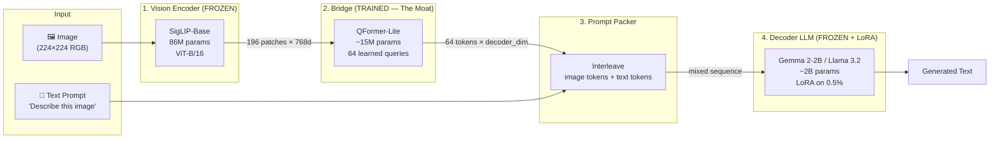
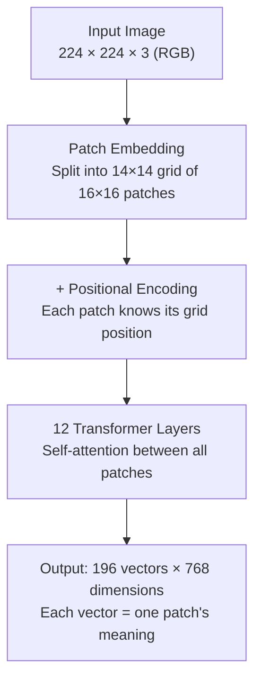
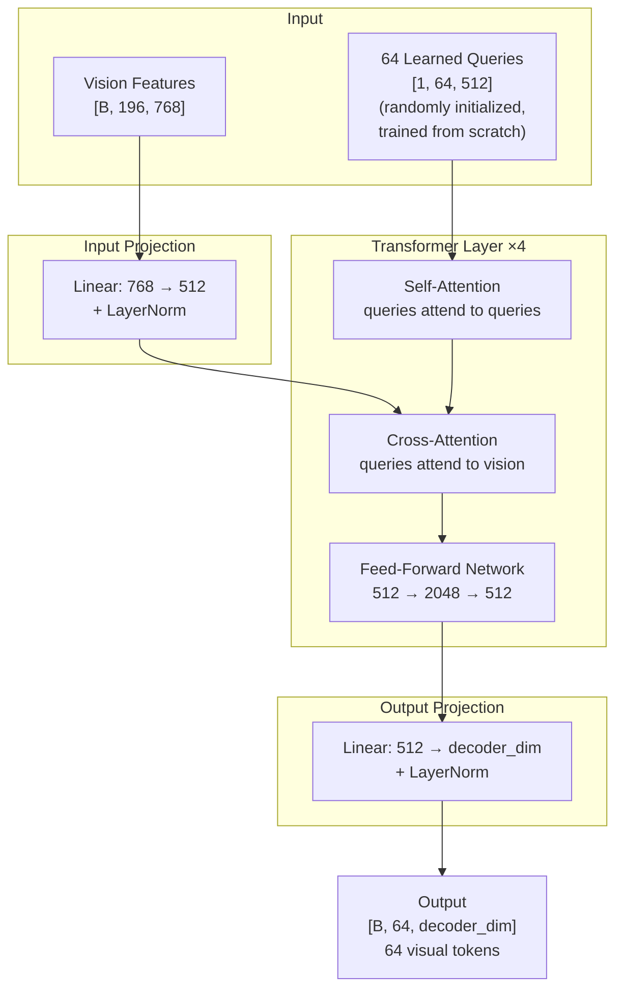
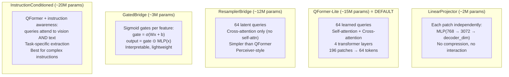
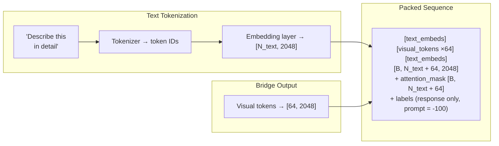
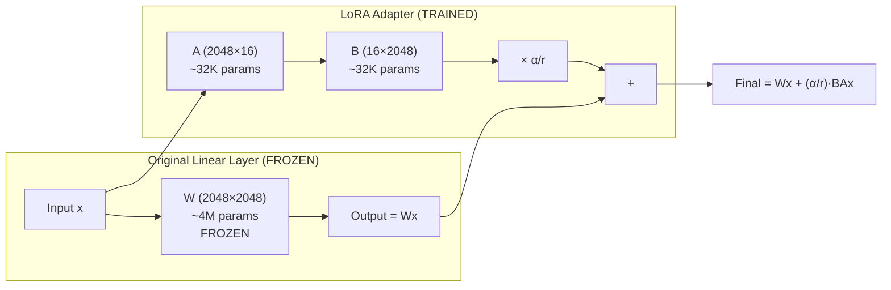
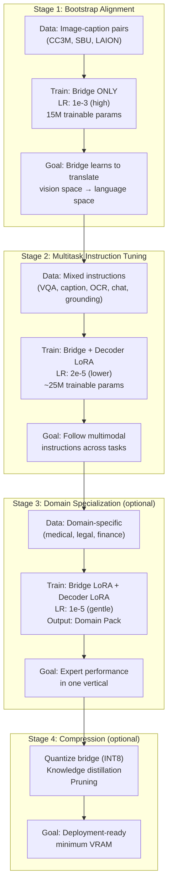
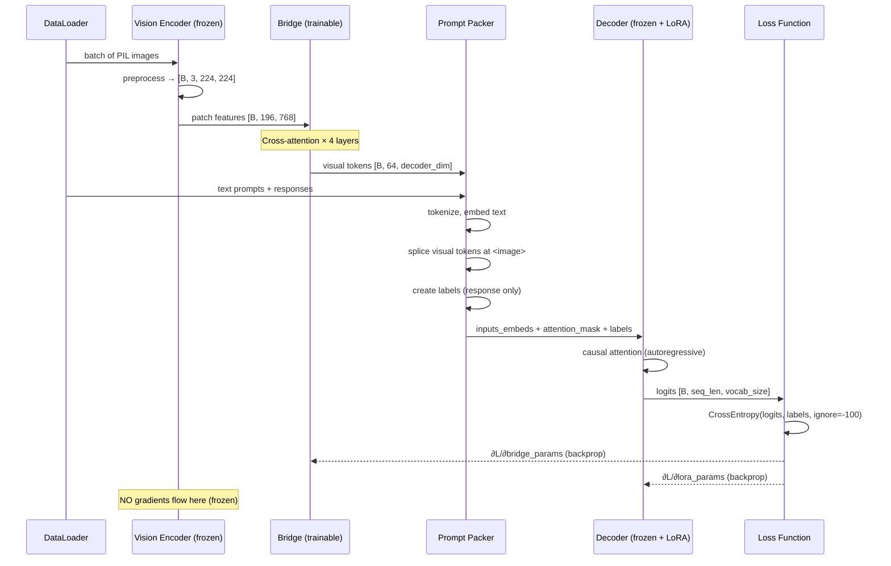

# Karna VLM — Deep Architecture Guide

**Why every layer exists, what algorithm drives it, and why we chose it.**

---

## System Overview



---

## Why This Architecture?

### The Core Insight: Don't Train What You Don't Need To

A typical VLM (LLaVA-7B, InternVL-8B) has 7-8B parameters. Training that requires 8× A100s for days. We split the problem:

| Component | Size | Training Cost | Why It Works |
|-----------|------|--------------|--------------|
| Vision Encoder | 86M | **$0** (frozen) | Pre-trained on 400M+ image-text pairs. Already knows what things look like. |
| Bridge | 15M | **$50-200** (1 GPU, hours) | Small neural network that translates "what things look like" into "words the decoder understands" |
| Decoder | 1-3B | **$0** (frozen, LoRA only) | Already knows language. Just needs a few adapted attention heads (~10M params) to accept visual input. |

**Total trainable: ~25M params** instead of 7B. That's **280× less compute**.

This isn't a hack — it's the same architecture as BLIP-2 (Salesforce), Flamingo (DeepMind), and MiniGPT-4 (KAUST). We refined it for production deployment.

---

## Component 1: Vision Encoder

### What It Does

Converts a raw image into a grid of feature vectors — one per image "patch."



### The Algorithm: Vision Transformer (ViT)

**Step 1: Patch Embedding**
- Divide the 224×224 image into a 14×14 grid of 16×16 pixel patches
- Each patch is flattened (16 × 16 × 3 = 768 values) and linearly projected to a 768-dim vector
- This is equivalent to a single Conv2d with kernel_size=16, stride=16

```
patch_embed = Conv2d(3, 768, kernel_size=16, stride=16)
# Input:  [B, 3, 224, 224]
# Output: [B, 768, 14, 14] → reshape to [B, 196, 768]
```

**Step 2: Positional Encoding**
- Add a learned 768-dim vector to each patch based on its grid position
- Without this, the model couldn't distinguish "cat in top-left" from "cat in bottom-right"

**Step 3: Transformer Layers (×12)**
Each layer applies:

```
x = x + MultiHeadSelfAttention(LayerNorm(x))    # patches attend to each other
x = x + FFN(LayerNorm(x))                        # per-patch nonlinear transform
```

The **self-attention** mechanism lets every patch see every other patch:
```
Attention(Q, K, V) = softmax(Q·K^T / √d_k) · V
where Q = x·W_Q, K = x·W_K, V = x·W_V
```

After 12 layers, each patch vector (768-dim) encodes not just its own pixels but its relationship to every other patch. The patch containing a dog's ear "knows" there's a dog's body nearby.

### Why SigLIP Over CLIP?

| Feature | CLIP (OpenAI) | SigLIP (Google) |
|---------|--------------|----------------|
| Training objective | Contrastive (softmax over batch) | Sigmoid (independent per pair) |
| CLS token | Yes (patch features + CLS) | No (patches only) |
| Patch quality | Good | **Better** — no information diluted into CLS |
| Origin | OpenAI (US) ✅ | Google (US) ✅ |
| License | MIT ✅ | Apache 2.0 ✅ |

SigLIP's sigmoid loss trains each image-text pair independently instead of comparing across the batch. This produces **better per-patch features** — which is exactly what our bridge needs. We don't use the CLS token; we want the raw spatial information.

### Why Freeze It?

SigLIP was trained on **400M+ image-text pairs** (WebLI). Our domain data will be 1-10M examples. Fine-tuning the encoder on 100× less data would **degrade** its representations. The encoder is already a near-perfect "eye" — we just need to teach the bridge how to translate what it sees.

---

## Component 2: The Bridge (The Moat)

This is **our trainable neural network** — the only component we fully train from scratch. It solves a specific problem: vision features (768-dim SigLIP space) are incompatible with decoder features (2048-dim Gemma space). The bridge compresses, aligns, and translates.

### The Problem It Solves

```
Vision encoder outputs: 196 vectors × 768 dimensions (SigLIP space)
Decoder expects:        N tokens × 2048 dimensions (Gemma space)

These are DIFFERENT vector spaces with DIFFERENT dimensionalities.
You can't just concatenate them.
```

### QFormer-Lite: The Default Bridge



### The Algorithms Inside the Bridge

#### Learned Query Tokens

```python
self.queries = nn.Parameter(torch.randn(1, 64, 512) * 0.02)  # randomly initialized
self.query_pos = nn.Parameter(torch.randn(1, 64, 512) * 0.02)  # positional encoding
```

These 64 vectors are **the model's "questions about the image."** They start as random noise and learn through training to ask things like:
- Query 0: "What's the main subject?"
- Query 17: "What text is visible?"
- Query 42: "What's the spatial layout?"

We don't program these meanings — they emerge from training on image-caption pairs.

**Why 64 queries?** This is a compression ratio. 196 vision patches → 64 visual tokens. More queries = more information preserved but slower decoding. 64 is the sweet spot: enough to represent complex scenes, small enough for efficient generation.

#### Self-Attention (Queries ↔ Queries)

```python
# Queries attend to each other to share information
queries = LayerNorm(queries)
queries = queries + MultiHeadAttention(queries, queries, queries)
```

This lets the queries coordinate. If query 3 is capturing "dog" and query 7 is capturing "park," self-attention lets them form the concept "dog in a park" before asking the image for more details.

**Algorithm:**
```
Q, K, V = queries @ W_Q, queries @ W_K, queries @ W_V
attention = softmax(Q · K^T / √d_head) · V       # [64, 64] attention matrix
output = attention @ W_out
```

Each of the 8 attention heads operates at dimension 512/8 = 64. Multiple heads capture different relationship types (spatial, semantic, count, etc.)

#### Cross-Attention (Queries → Vision Features)

This is the **key mechanism** — where the bridge actually looks at the image:

```python
# Each query selects information from the 196 image patches
queries_normed = LayerNorm(queries)
cross_out, attn_weights = CrossAttention(
    query=queries_normed,        # [B, 64, 512]  - what to ask
    key_value=vision_features,   # [B, 196, 512] - what to look at
)
queries = queries + cross_out
```

**Algorithm:**
```
Q = queries @ W_Q        # [B, 64, 512]  → "64 questions"
K = vision @ W_K          # [B, 196, 512] → "196 answers available"
V = vision @ W_V          # [B, 196, 512] → "196 information packets"

attention = softmax(Q · K^T / √d_head)   # [B, 8, 64, 196]
# ^ For each query, a probability distribution over which patches to attend to

output = attention · V    # [B, 8, 64, 64] → [B, 64, 512]
# ^ Weighted sum of vision information, selected by each query's attention
```

The attention weights tell us **which image patches each query focuses on**. This is interpretable — you can visualize which query looks at which part of the image (see `inference/visualize.py`).

#### Feed-Forward Network (Per-Token Transform)

```python
self.ffn = nn.Sequential(
    nn.Linear(512, 2048),     # expand
    nn.GELU(),                # nonlinear activation
    nn.Dropout(0.1),
    nn.Linear(2048, 512),     # compress back
    nn.Dropout(0.1),
)
queries = queries + self.ffn(LayerNorm(queries))
```

**Why?** Self-attention and cross-attention are linear operations that mix information between positions. The FFN provides **per-position nonlinearity** — it lets each query independently transform its gathered information into a richer representation.

**GELU activation:** `GELU(x) = x · Φ(x)` where Φ is the normal CDF. Unlike ReLU (which kills negative values), GELU smoothly gates values, allowing small negative signals through. This is empirically better for transformers.

**Expansion ratio 4×:** The intermediate dimension (2048 = 512 × 4) gives the network enough capacity to learn complex feature transformations without permanently increasing the sequence dimension.

#### Output Projection

```python
output = self.output_proj(queries)   # Linear: 512 → decoder_dim (2048 for Gemma 2)
output = self.output_norm(output)    # LayerNorm for training stability
```

This final linear layer maps from bridge space (512d) to decoder space (2048d for Gemma, 2048d for Llama). After this, the 64 visual tokens are indistinguishable in shape from normal text embeddings — the decoder doesn't know they came from an image.

#### Weight Initialization

```python
nn.init.trunc_normal_(module.weight, std=0.02)  # truncated normal, σ=0.02
nn.init.zeros_(module.bias)                       # biases start at zero
nn.init.ones_(norm.weight)                        # LayerNorm scale = 1
nn.init.zeros_(norm.bias)                         # LayerNorm shift = 0
```

**Why 0.02?** At initialization, we want the bridge to be a near-identity mapping (small random perturbations). Too large (>0.1) = training instability. Too small (<0.001) = vanishing gradients. 0.02 is the empirical sweet spot from the original transformer paper, validated across GPT, BERT, ViT, and now VLM bridges.

### Bridge Variants Comparison



**When to use which:**

| Bridge | Use When | Trade-off |
|--------|----------|-----------|
| **Linear** | Debugging, fast iteration, ablation baselines | No compression (196 tokens = slow decoding) |
| **QFormer-Lite** | Production default, most tasks | Great balance of quality and speed |
| **Resampler** | You want Flamingo-style architecture | Slightly less expressive than QFormer |
| **Gated** | You need interpretability (which features matter?) | Limited capacity for complex scenes |
| **InstructionConditioned** | Complex multi-step instructions, document analysis | Most parameters, slowest bridge |

---

## Component 3: Prompt Packer

The packer assembles the final input sequence for the decoder:



The `<image>` token in the text is replaced with the 64 visual embeddings from the bridge. If no `<image>` placeholder exists, visual tokens are prepended.

**Label masking:** During training, only the response tokens have real labels. The prompt, image tokens, and padding all get label=-100 (PyTorch's ignore index), so the model only learns to predict the answer.

---

## Component 4: Decoder LLM

### Why Gemma 2 / Llama 3.2?

| Requirement | Gemma 2-2B (Google) | Llama 3.2-1B/3B (Meta) |
|------------|--------------------|-----------------------|
| Open weights | ✅ Apache 2.0 (Gemma) | ✅ Llama 3.2 Community |
| Open architecture | ✅ Published paper, HF native | ✅ Published paper, HF native |
| US origin | ✅ Google | ✅ Meta |
| Government safe | ✅ No export restrictions | ✅ No export restrictions |
| Size | 2B params | 1B / 3B params |
| Quality/size ratio | Excellent (SOTA at 2B) | Excellent (SOTA at 1B/3B) |
| HuggingFace native | ✅ No `trust_remote_code` needed | ✅ No `trust_remote_code` needed |

**Why NOT Qwen?** Qwen is from Alibaba (China). For government work, this creates supply-chain risk and potential compliance issues under ITAR/EAR. We use only US-origin models with permissive licenses.

**Why NOT Mistral?** Mistral (France) is fine legally, but Gemma 2-2B and Llama 3.2 benchmark higher at equivalent sizes. We can add Mistral as an option later.

### How the Decoder Sees Multimodal Input

The decoder doesn't know it's looking at an image. It receives a sequence of 2048-dim vectors:

```
Position 0:    "Describe"     (text embedding)
Position 1:    "this"         (text embedding)
Position 2-65: [visual tokens from bridge]  (look like text embeddings)
Position 66:   "in"           (text embedding)
Position 67:   "detail"       (text embedding)
Position 68+:  [generated tokens, one at a time]
```

The bridge's job was to make those 64 visual tokens **look like really informative text tokens** to the decoder. The decoder's existing language understanding handles the rest.

### LoRA: How We Adapt the Decoder Without Full Training



**The Math:**
```
Original: y = Wx                           (4M params, frozen)
LoRA:     y = Wx + (α/r) · B·A·x          (64K params, trained)

where:
  W ∈ ℝ^{2048×2048}  — original weight matrix (frozen)
  A ∈ ℝ^{r×2048}     — down-projection (trained)
  B ∈ ℝ^{2048×r}     — up-projection (trained, initialized to zero)
  r = 16              — rank (hyperparameter)
  α = 32              — scaling factor
```

**Why this works:** The weight update ΔW = BA has rank r (16). Research shows that fine-tuning updates to large language models are **low-rank** — you don't need to change all 4M entries in a weight matrix. A rank-16 perturbation (~64K params) captures >95% of the adaptation needed.

**Why B is zero-initialized:** At training start, BA = 0, so the LoRA output is zero and the model behaves exactly as the original. Training smoothly moves away from the original behavior. This prevents catastrophic forgetting — the model starts from a known good point.

**We apply LoRA to:** `q_proj` and `v_proj` in each attention layer (the query and value projections). These are empirically the most impactful projections for VLM adaptation. For the Mid variant, we also LoRA `k_proj` and `o_proj`.

---

## Training Pipeline: The Four Stages



### Why 4 Stages?

**Stage 1 (high LR, bridge only):** The bridge starts as random noise. It needs aggressive learning (LR=1e-3) to quickly align vision space with language space. We don't touch the decoder because there's nothing useful coming from the bridge yet.

**Stage 2 (low LR, bridge + LoRA):** Now the bridge produces meaningful visual tokens. We turn on decoder LoRA at a gentle LR (2e-5) to teach the decoder how to use these tokens for instruction following. The bridge continues training at a lower LR (refinement, not alignment).

**Stage 3 (very low LR, LoRA only):** The general model is good. Domain specialization adds a thin layer of expert knowledge without destroying general capabilities. Output is a portable "domain pack."

**Stage 4 (no training):** Quantize the bridge from FP32 → INT8 (2× smaller, 1.5× faster). The bridge is the most parameter-efficient component but also the most latency-critical.

---

## Why Neural Networks? Why Not Something Simpler?

### Could We Use a Linear Projection Instead?

Yes — that's the `LinearProjector` bridge. It maps each patch independently:

```
output[i] = MLP(vision_patch[i])    for i in 0..195
```

Problems:
1. **No compression:** 196 output tokens. The decoder has to process all 196. That's 3× slower than QFormer's 64 tokens.
2. **No cross-patch reasoning:** Patch 42 (dog's ear) can't see patch 98 (dog's body). The model can't form holistic concepts.
3. **No query specialization:** Every patch is treated identically. Some patches (sky, grass) are irrelevant to "what animal is this?"

### Could We Use Classical CV + Lookup Tables?

No. The bridge needs to:
1. **Compress** 196 → 64 tokens (selective attention, not random downsampling)
2. **Map between spaces** (768d SigLIP → 2048d Gemma — these are learned, not arithmetic)
3. **Specialize per task** (InstructionConditioned variant changes what it extracts based on the question)

These are all learned, nonlinear, context-dependent operations. No fixed algorithm can do this.

### Why Cross-Attention Specifically?

Cross-attention is the mathematically optimal way for a small set of queries (64) to extract information from a large set of keys (196 patches):

```
Relevance(query_i, patch_j) = softmax(q_i · k_j / √d)
Extracted_info(query_i) = Σ_j relevance(i,j) · value(patch_j)
```

This is a **differentiable, weighted information retrieval** operation. Each query learns to "ask" for specific visual information, and the attention weights tell us exactly what it found. Alternative: pooling (mean/max) destroys information. Concatenation doesn't compress. Only attention provides selective, learnable compression.

---

## Full Forward Pass (Training Mode)



---

## Model Provenance Summary

| Component | Model | Organization | Country | License | Architecture Published |
|-----------|-------|-------------|---------|---------|----------------------|
| Vision Encoder | SigLIP-Base | Google | USA | Apache 2.0 | ✅ Paper + code |
| Vision Encoder (alt) | CLIP-ViT-B/16 | OpenAI | USA | MIT | ✅ Paper + code |
| Decoder (Tiny) | Llama 3.2-1B | Meta | USA | Llama 3.2 Community | ✅ Paper + code |
| Decoder (Small) | Gemma 2-2B | Google | USA | Gemma License | ✅ Paper + code |
| Decoder (Mid) | Llama 3.2-3B | Meta | USA | Llama 3.2 Community | ✅ Paper + code |
| Bridge | Karna QFormer-Lite | Ours | — | Apache 2.0 | ✅ This document |

**Zero Chinese-origin components. Zero restricted licenses. Full architecture transparency.**

---

## Key References

1. **Vision Transformer (ViT):** Dosovitskiy et al., "An Image is Worth 16x16 Words" (2020)
2. **SigLIP:** Zhai et al., "Sigmoid Loss for Language Image Pre-Training" (2023)  
3. **Q-Former / BLIP-2:** Li et al., "BLIP-2: Bootstrapping Language-Image Pre-training with Frozen Image Encoders and Large Language Models" (2023)
4. **Perceiver Resampler / Flamingo:** Alayrac et al., "Flamingo: a Visual Language Model for Few-Shot Learning" (2022)
5. **LoRA:** Hu et al., "LoRA: Low-Rank Adaptation of Large Language Models" (2021)
6. **Llama 3.2:** Meta AI, "Llama 3.2: Revolutionizing edge AI and vision with open, customizable models" (2024)
7. **Gemma 2:** Google DeepMind, "Gemma 2: Improving Open Language Models at a Practical Size" (2024)
